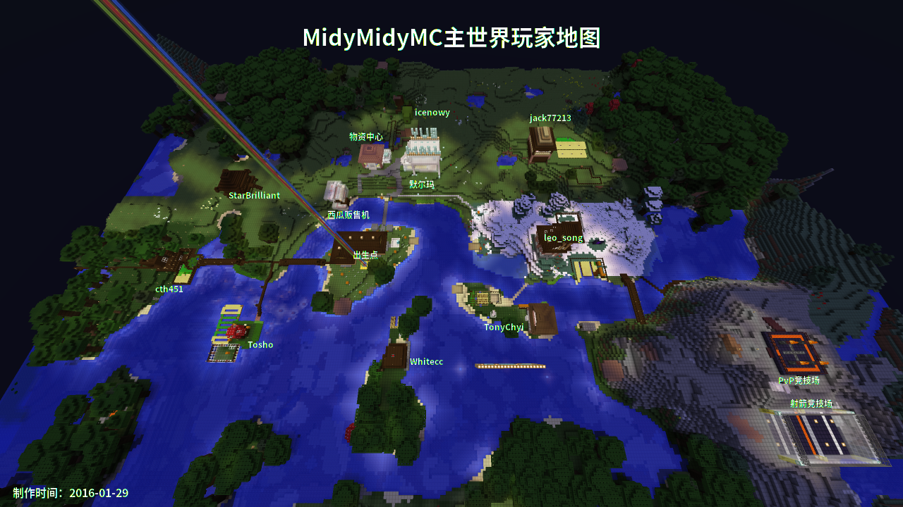

MidyMidy 第三周目
=====

> 我的子民们，欢迎回来！ -- King Casper

MidyMidy Minecraft 的主题是：

> 朴素的生存 -- StarBrilliant

**由于时有更新，请Watch这个Repo**

服务器基本信息
-----

### 1. 访问地址
* 121.42.30.62（主地址）
* 114.215.156.251（分流地址）
* mc.midymidy.com （Star Brilliant 提供，有负载均衡）
* mc.hijack.moe （Jack Zhang 提供，有负载均衡）
* mc-leo.hijack.moe （Jack Zhang 提供，直接连接服务器）
* mc-bak.hijack.moe （Jack Zhang 提供，使用中转服务器）
* mc.wetofu.top （TonyChyi 提供，有负载均衡）

### 2. 插件
* CrazyLogin：登录管理器
* iConomy：金钱插件
* SignShop：木牌商店
* Lockette：木牌锁箱插件
* WorldEdit：地图编辑器
* WorldGuard：防爆插件
* GameModeInventories：不同游戏模式的独立物品栏
* HomeSpawnPlus：设置家和出生点
* MoneyMobs：杀怪赚钱
* MotdManager：服务器提示（Motd）插件
* MultiWorld：多世界插件，提供一个创造界
* PerfectBackup：备份
* PermissionsEx：权限管理
* PurpleIRC：IRC对接
* ServerWelcome：服务器登录欢迎
* Mailbox：邮箱插件
* TreeAssist：砍树插件
* SkinsRestorer：正版玩家皮肤修复
* ModifyWorld

### 3. IRC
\#MidyMidymc@freenode.net

### 4.邮件列表

midymidy-mc@googlegroups.com

### 5.系统商店

现有MrBrick和MrQuartz两位交易员，可以用石头（烧过的那种）和他们交换砖块和石英。

系统商店现在出售：
* 线x1 20元
* 箭矢x64 64元
* 羊蛋x2 800元
* 牛蛋x2 1000元
* 把时间调成白天 40元

现在河边（出生点小岛对面）有玩家商店，种类丰富，欢迎选购。

新建了购物广场（默尔玛），里面空着的位置都可以用来卖东西。

只需要将你的牌子贴在商场的空位就可以了，箱子建议放在自己家，便于补货。

商店的建法参照“SignShop用法”一节

### 6.主城地图


[离线地图](https://wetofu.top/midymidymc)（用到 Google 的 API，梯子自备）

出生点附近找到命名为`Newbie Suits`的牌子右键可以领取新手套件，包括以下物品：
* 猪排 16 个
* 服务器规则
* 邮箱教程
新手套件只能领取一次

物资中心可以在您还没建造自己的房屋时存放/合成/修复/酿造/熔炼您的物品，在地下 2 层设有仓库，存放物品时请自行上锁。
当您建好自己的房屋后，请及时迁出您存放的物品，以便其他人使用

### 7.交通

#### 铁路

铁路修建采取众包模式。

目前已通车的线路：

* 1号线（沼泽-出生点-竞技山-末地要塞）


### 8.关于熊孩子

1. 出现任何事故的时，管理员有权利当场冻结账户（为了防止破坏规模扩散），并进行警告。必要可以时回档。
2. 如果警告无效，冻结账户24小时至48小时，开邮件讨论投票。
3. 投票的结果如果是封禁：
	- 如果这个用户第一次引发我们投票，视情节轻重，临时封禁或永久封禁。
	- 如果这个用户引发了我们多次投票，永久封禁。
4. 如果永久封禁，我们将四处宣扬此人的“光辉”事迹。

各插件使用方法
-----

### 登录和权限

登录后属于default组，不能做什么事情。

用`/register <你的密码>`命令注册，然后我就可以手动把你们放到player组里面去。

注册完了最好水一封邮件到邮件列表

### 锁箱插件

放一个箱子，直接在上面放一块牌子，什么也不输入直接退出，然后就锁住了。

### 经济系统

现在改用iConomy插件 + SignShop插件。

使用`/money`或者`/bal`命令查看余额，每个人最初有300元钱。

通过MoneyMobs插件来增发货币。
* 僵尸8两
* 蜘蛛10两
* 骷髅12两
* 爬行者10两
* 僵尸猪人10两
* 女巫15两
* 小黑14两
* 末影龙2000两
* 凋灵3000两

### SignShop用法：

1. 放一个箱子，锁不锁随意。在里面放上一次性要卖掉的东西（每次卖这么多）。
2. 放一个牌子，格式见下方。
3. 手持红石粉，左键单击箱子，然后在左键单击牌子，即可关联。
4. 左键单击牌子可查看商店内容（可以精准的看到所出售的物品），右键单击牌
子可以购买东西。
5. 拆除商店请使用金斧子。

牌子的格式如下：
```ini
[Buy]
东西名字（随意填写）
描述（随意）
价格
```

### 穿越到创造界

在出生点附近可以找到传送点，即可穿越到创造界。

如果在创造界迷路，可以使用`/spawn`回到传送点。

创造界包含了以往周目中的经典建筑和图绘

* 820 Scientific Tower - by: 佚名
* Apple II - by: Garfield550
* Creeper Statue - by: TonyChyi
* Enderman Statue - by: 佚名
* Boc Tower - by: Akarin
* Gengzai Statue - by: Gengzai
* 水上金塔 - by: Akarin
* Linux图绘 - by: TonyChyi
* 飞面神图绘 - by: TonyChyi
* 飞舞旋律 - by: Jimmy
* 炮姐图绘 - by: Jimmy
* 裸体炮姐图绘 - by: 図書
* Homer.J.Simpson - by: Leo_song
* 皮卡丘 - by: Jimmy
* 红魔馆 - by: Jimmy
* 东方全家桶 - by: 図書
* 彩虹酒店 - by: Leo_song
* 丰甜神庙 - 丰甜儿
* KDE Icons - Icenowy

### 飞行

~~手里拿着鸡毛，用右键即可飞行，不过要Hold住小心摔伤！~~

> ~~Hold a feather, face the sky, click the right button and you can fly -- Star Brilliant~~

~~降落的诀窍是按住右键的同时把脸朝向地面，可以缓慢降落。~~

已取消 SmoothFlight 插件。

### 砍树

从树的最下面开始砍，树会自己掉落原木，并自动补种

砍树插件只在主世界有效

### 邮箱插件

#### 创建邮箱

使用`/mailbox create`命令，然后左键点击你要当作邮箱的箱子，就会提示邮箱创建成功

#### 移除邮箱

使用`/mailbox remove`

#### 发送物品

使用`/mailbox send <玩家名称>`即可将当前手中拿的物品发送给对方

#### 查看费率

使用`/mailbox fee`

服务器礼节
-----

见[服务器礼节](服务器礼节.md)

MC1.8整合包
-----

[下载地址](http://pan.baidu.com/s/1dEe6YPV)

资源
-----
* [Minecraft 中文 Wiki](http://minecraft-zh.gamepedia.com)
